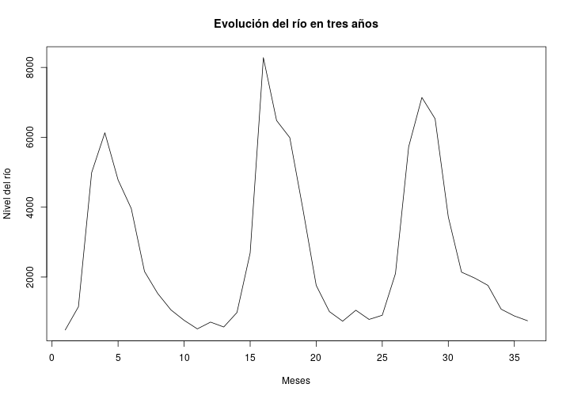
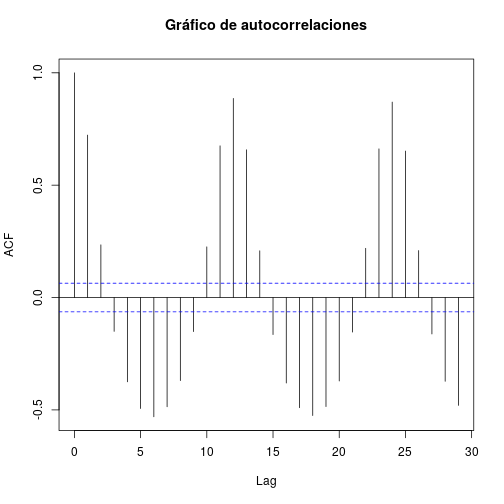
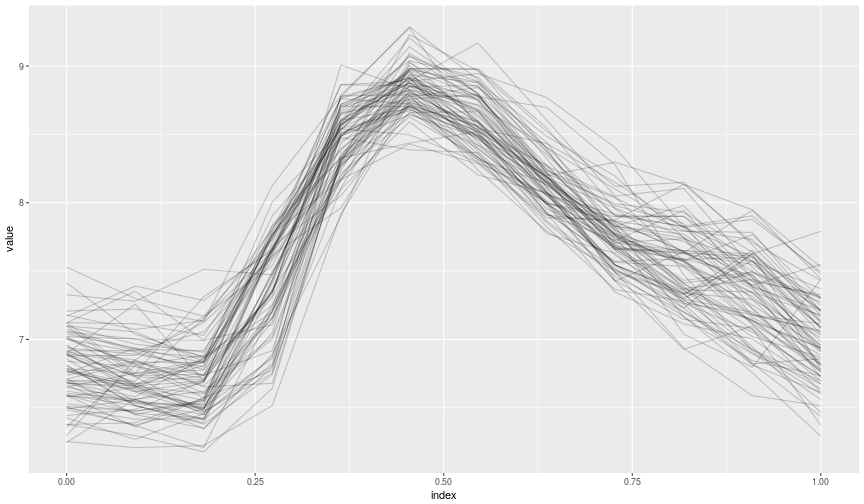
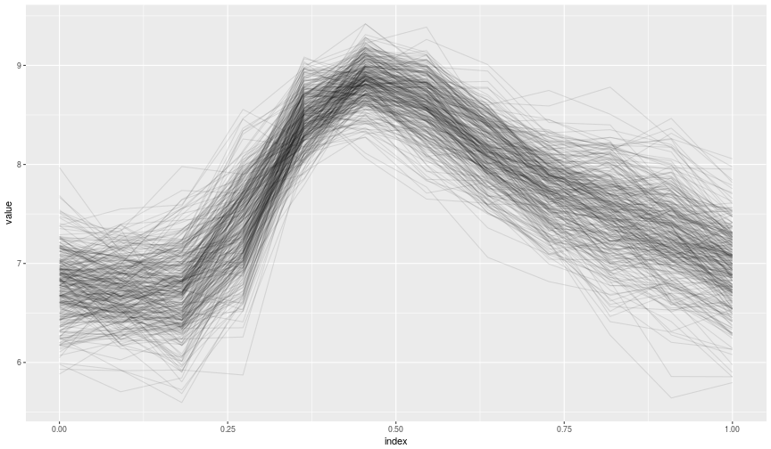
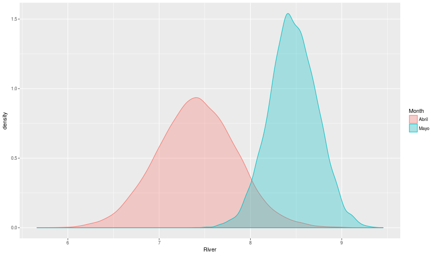
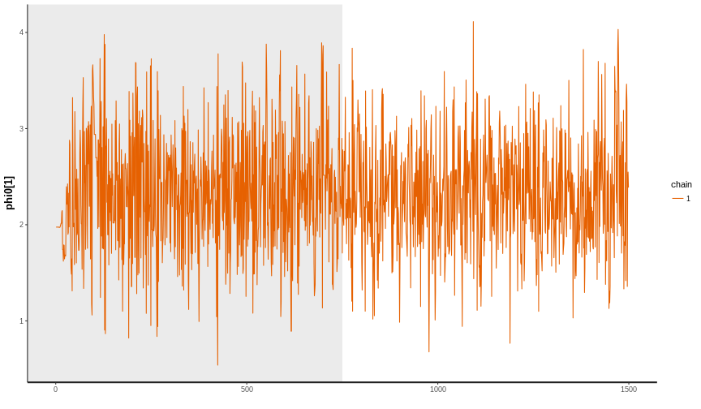

PAR(1) models in stan. Application to Fraser River data
========================================================
author: JC Laria de la Cruz
date: May 10, 2017
autosize: true


Datos
========================================================

Fuente: <http://lib.stat.cmu.edu/datasets/fraser-river>. 
  - $946$ observaciones de una variable (nivel medio mensual).


```r
river <- read.table('fraser-river.txt'); head(river)
```

```
    V1
1  485
2 1150
3 4990
4 6130
5 4780
6 3960
```


Datos
========================================================




Datos
========================================================




Ojetivo
========================================================

Parte $A$
- Se pide estimar la *probabilidad* de que el río desborde en un mes superando los $10000 m^3/s$.


Modelo
========================================================

Parte $A\cdot B$
- Modelamos el nivel del río utilizando un PAR(1) - *Periodic Autoregressive Model of order 1*.
- Un modelo AR(1) tiene la forma

$$ y_t \sim Normal(\phi_0+\phi_1 y_{t-1}, \varphi)$$

- En un modelo PAR(1) incluimos componentes que varían según la estación. En nuestro caso el período de la serie (el número de estaciones) es 12.

$$ y_t \sim Normal(\phi_{0s}+\phi_{1s} y_{t-1}, \varphi_s), s=1,2, \ldots 12.$$


Modelo Jerárquico
========================================================


- $Y_{t} \big|\{ \phi_{0s}, \phi_{1s}, \varphi_s, Y_{t-1} \} \sim Normal(\phi_{0s} + \phi_{1s} Y_{t-1}, \varphi_s)$,
- $\phi_{0s}\sim Normal(\mu_0, \sigma_0^2)$,
- $\phi_{1s}\sim Normal(\mu_1, \sigma_1^2)$,
- $\varphi_{s}^2\sim InvGamma(\alpha, \beta)$.

Estamos interesados en $P(Y_t > 10000)$. Note que $t$ depende de $s$, por ejemplo, 

$$ t = 12 \cdot n + s, \quad n \in \mathbb{Z}_+.$$

Datos transformados y centrados
========================================================

Estos son nuestros datos. Aplicamos una transformación logarítmica.



Modelo en Stan
=======================================================

[Full source code](https://jlaria.github.io/fraser-river/trabajo.html#implementacion)


```r
  for(i in 2:N){
    y[i] ~ normal( phi0[season]+phi1[season]*y[i-1], varphi[season] );
    season=season+1;
    if(season>12){
      season=1;
    }
  }
```

Trayectorias Simuladas
======================================================



Densidad de probabilidad marginal
======================================================



Probabilidad de desbordamiento por mes
=====================================================


|      |       May|   June|      July|    August|
|:-----|---------:|------:|---------:|---------:|
|Prob. | 0.0017333| 0.0472| 0.0145333| 0.0002667|

Gráficos de diognóstico
=========================================

Diagnóstico usando el *traceplot* del *muestreo de Gibbs* para la variable $\phi_{01}$. 



Resultados
========================================

Parte $B^{-1}\cdot A \cdot B$.

- La probabildad estimada de que el río desborde superando los 10000 $m^3/s$ en un mes es de $0.0053$.
- La probabilidad de que el río desborde en el mes de Junio es de $0.0472$.


```r
mean(result.sim$y_new[,]>log(10000))  
mean(result.sim$y_new[,12*(2:11)+6]>log(10000)) 
```

